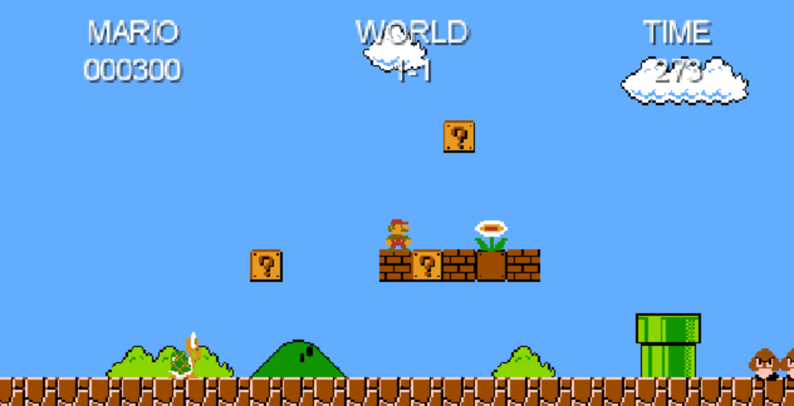

# Super Mario Bros.

[](https://travis-ci.com/fosdickio/super-mario-bros)

This is a clone of the original Super Mario Bros. game for the Nintendo Entertainment System.  It is built in Java using the [libGDX game development library](https://libgdx.badlogicgames.com/).



## Requirements
- Java 8
- Gradle

## Instructions
```
./gradlew run
````

## Controls
* `Left/right arrow keys` - move left/right
* `Up arrow key` - jump
* `Space bar` - shoot fireball

## Features
* Mario becomes big after using a mushroom
* Score updates as coins are picked up, enemies are killed, and power-ups are found
* Goomba and Koopa enemies are implemented
* Enemies are killed by bouncing on their head
* Mario dies if he falls off the level
* Sound effects and music are true to the original
* Power-ups include mushroom and flower
* Mario can kick turtle shell after jumping on turtle
